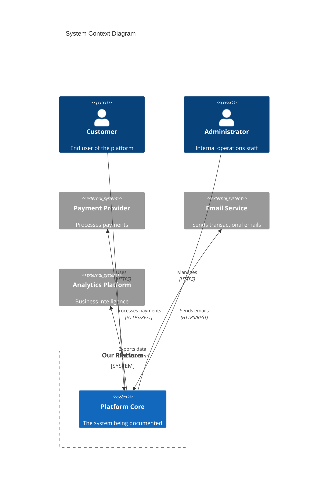
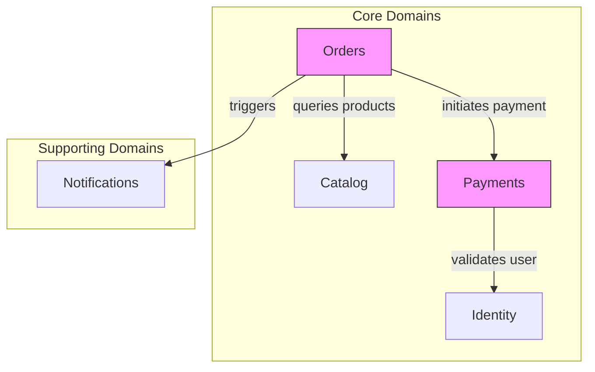

# System Architecture Overview

> **Document Type**: Root Architecture Document (Level 1 - Context)
> **Last Updated**: {YYYY-MM-DD}
> **Version**: {X.Y.Z}

## Document Map

This is the entry point for all architecture documentation. For complex systems, architecture is documented hierarchically. Start here and navigate to domain-specific documents as needed.

```
ARCHITECTURE.md (You are here)
│
├── domains/
│   ├── identity/ARCHITECTURE.md      → User identity and authentication
│   ├── payments/ARCHITECTURE.md      → Payment processing and billing
│   ├── catalog/ARCHITECTURE.md       → Product catalog management
│   ├── orders/ARCHITECTURE.md        → Order lifecycle management
│   └── notifications/ARCHITECTURE.md → Communication and alerts
│
├── platform/
│   ├── infrastructure/ARCHITECTURE.md → Cloud infrastructure and deployment
│   ├── data/ARCHITECTURE.md           → Data platform and analytics
│   ├── integration/ARCHITECTURE.md    → API gateway and service mesh
│   └── observability/ARCHITECTURE.md  → Monitoring, logging, tracing
│
└── cross-cutting/
    ├── security/ARCHITECTURE.md       → Security architecture
    └── resilience/ARCHITECTURE.md     → Fault tolerance patterns
```

> **AI Instruction**: When working on a specific domain, load the corresponding domain architecture document for detailed context. This root document provides system-wide context only.

## System Purpose

{2-3 paragraphs describing what the system does at a business level. What problem does it solve? Who uses it? What value does it provide?}

## System Context Diagram



## Domain Overview

The system is organized into the following bounded contexts. Each domain is autonomous and owns its data. Cross-domain communication happens through well-defined contracts.

| Domain | Responsibility | Team | Documentation |
|--------|---------------|------|---------------|
| **Identity** | User accounts, authentication, authorization | Platform Team | [→ Architecture](./domains/identity/ARCHITECTURE.md) |
| **Payments** | Payment processing, billing, invoicing | Payments Team | [→ Architecture](./domains/payments/ARCHITECTURE.md) |
| **Catalog** | Product information, inventory, pricing | Catalog Team | [→ Architecture](./domains/catalog/ARCHITECTURE.md) |
| **Orders** | Order creation, fulfillment, returns | Orders Team | [→ Architecture](./domains/orders/ARCHITECTURE.md) |
| **Notifications** | Email, SMS, push notifications | Platform Team | [→ Architecture](./domains/notifications/ARCHITECTURE.md) |

### Domain Relationships



## Platform Services

Shared infrastructure and platform capabilities that all domains depend on.

| Service | Purpose | Documentation |
|---------|---------|---------------|
| **Infrastructure** | Cloud resources, networking, deployment | [→ Architecture](./platform/infrastructure/ARCHITECTURE.md) |
| **Data Platform** | Data warehouse, ETL, analytics | [→ Architecture](./platform/data/ARCHITECTURE.md) |
| **Integration** | API gateway, service mesh, protocols | [→ Architecture](./platform/integration/ARCHITECTURE.md) |
| **Observability** | Metrics, logs, traces, alerts | [→ Architecture](./platform/observability/ARCHITECTURE.md) |

## Cross-Cutting Concerns

Architectural aspects that span all domains and must be consistently applied.

| Concern | Description | Documentation |
|---------|-------------|---------------|
| **Security** | AuthN, AuthZ, encryption, compliance | [→ Architecture](./cross-cutting/security/ARCHITECTURE.md) |
| **Resilience** | Circuit breakers, retries, fallbacks | [→ Architecture](./cross-cutting/resilience/ARCHITECTURE.md) |

## System-Wide Principles

These principles apply across all domains. Domain-specific principles may extend but not contradict these.

### Principle 1: Domain Autonomy

Each domain owns its data and logic completely. No direct database access across domain boundaries. All inter-domain communication through published APIs or events.

### Principle 2: Event-First Communication

Prefer asynchronous event-based communication between domains. Use synchronous calls only when immediate consistency is required.

### Principle 3: API Contracts as Law

Public APIs between domains are versioned and treated as contracts. Breaking changes require migration periods and explicit coordination.

### Principle 4: Observability by Default

Every service exposes health checks, metrics, and structured logs. Distributed traces propagate through all service calls.

## Technology Radar

Current technology choices and their status across the organization.

| Category | Adopt | Trial | Assess | Hold |
|----------|-------|-------|--------|------|
| Languages | Python, TypeScript | Go, Rust | - | Java (legacy) |
| Databases | PostgreSQL, Redis | - | CockroachDB | MongoDB |
| Messaging | Kafka | - | Pulsar | RabbitMQ |
| Containers | Kubernetes | - | - | Docker Swarm |

## Navigation Guide for AI Assistants

> **AI Instruction**: Use this guide to determine which documents to consult.

**For feature implementation**:
1. Identify which domain owns the feature
2. Load that domain's ARCHITECTURE.md
3. Check cross-cutting concerns if security/resilience is involved

**For infrastructure changes**:
1. Load platform/infrastructure/ARCHITECTURE.md
2. Check integration architecture if APIs are affected

**For data model changes**:
1. Load the owning domain's architecture
2. Load platform/data/ARCHITECTURE.md if analytics is affected

**For debugging or incident response**:
1. Load platform/observability/ARCHITECTURE.md
2. Load affected domain's architecture

## Quick Reference

### Key Metrics

| Metric | Current | Target | Owner |
|--------|---------|--------|-------|
| System Availability | 99.9% | 99.95% | Platform Team |
| API Latency (p99) | 450ms | 300ms | All Teams |
| Deployment Frequency | 12/week | 20/week | All Teams |

### Critical Paths

1. **User Authentication**: Identity → API Gateway → All Services
2. **Payment Processing**: Orders → Payments → External Provider
3. **Order Fulfillment**: Orders → Catalog → Inventory → Shipping

### Emergency Contacts

| Domain | Primary | Secondary |
|--------|---------|-----------|
| Platform | {Name} | {Name} |
| Payments | {Name} | {Name} |

## Related Documents

- [ADR Index](./decisions/README.md) - All architectural decisions
- [RFC Index](./proposals/README.md) - Change proposals
- [Changelog](./evolution/CHANGELOG.md) - Architecture evolution history
