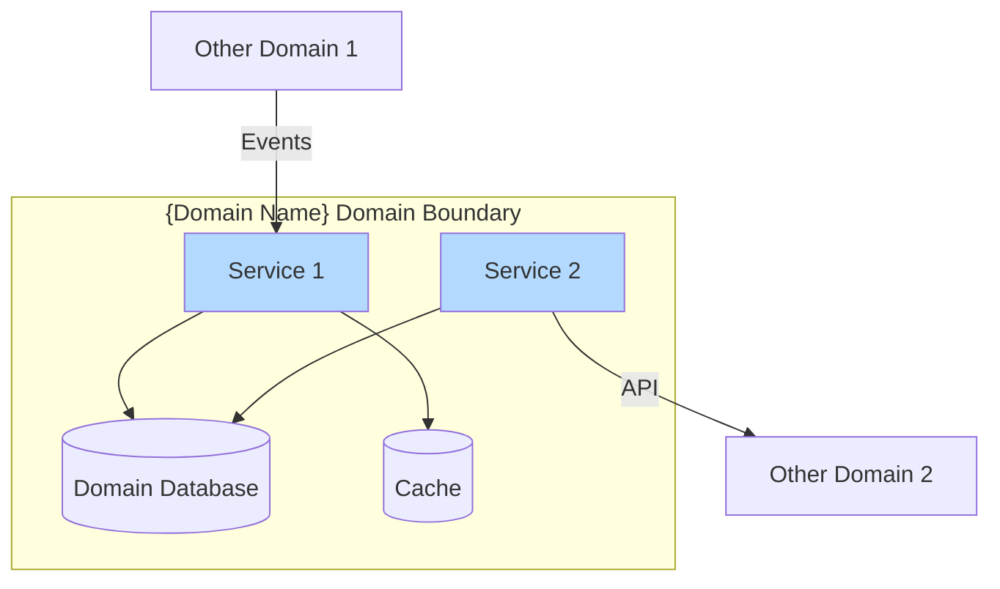
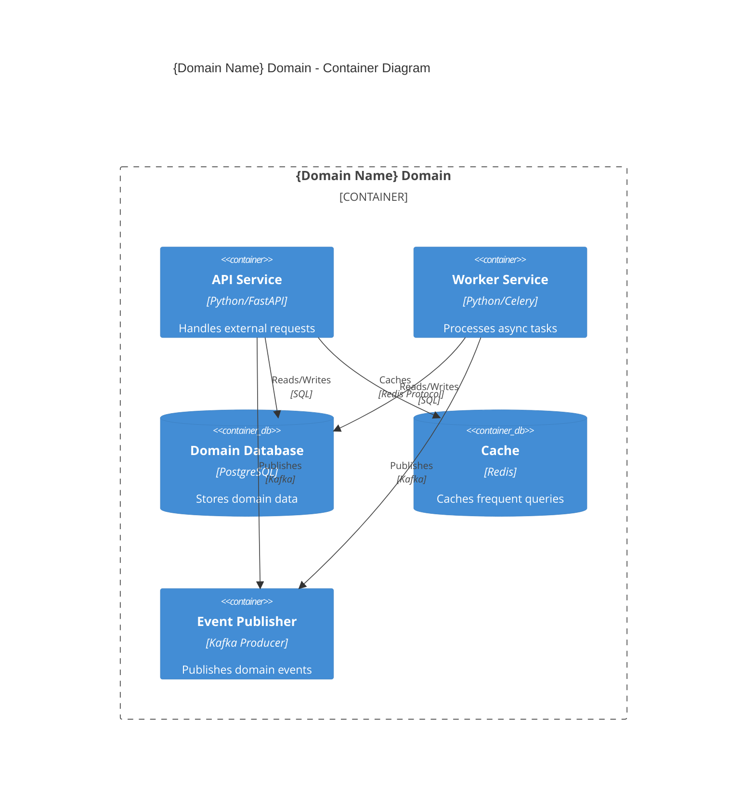
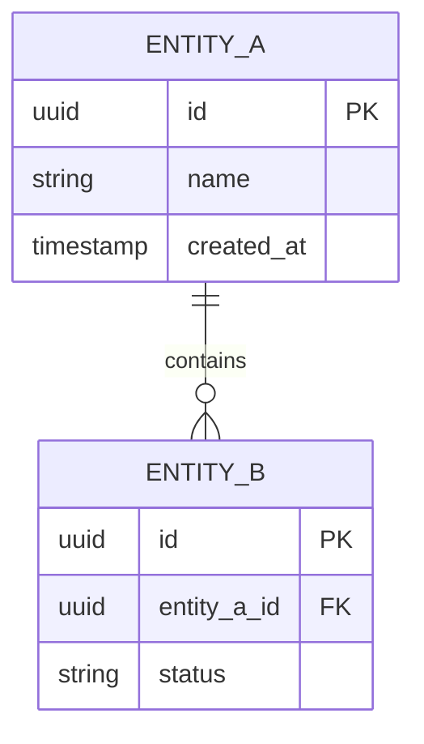

# {Domain Name} Domain Architecture

> **Document Type**: Domain Architecture Document (Level 2 - Container)
> **Parent**: [System Architecture](../../ARCHITECTURE.md)
> **Last Updated**: {YYYY-MM-DD}
> **Domain Owner**: {Team Name}

## Document Scope

This document describes the architecture of the **{Domain Name}** bounded context. For system-wide context and principles, see the [root architecture document](../../ARCHITECTURE.md).

### What This Document Covers

- Internal structure of the {Domain Name} domain
- Services and components within this domain
- Data models owned by this domain
- APIs exposed by this domain
- Integration points with other domains

### What This Document Does NOT Cover

- Implementation details of other domains
- Infrastructure configuration (see [Infrastructure](../../platform/infrastructure/ARCHITECTURE.md))
- System-wide security policies (see [Security](../../cross-cutting/security/ARCHITECTURE.md))

## Domain Overview

### Business Capability

{Describe the business capability this domain provides. What business problem does it solve? What would happen if this domain didn't exist?}

### Domain Boundaries



### Ubiquitous Language

Key terms used within this domain. All code, documentation, and communication should use these terms consistently.

| Term | Definition | Notes |
|------|------------|-------|
| {Term 1} | {Precise definition} | {Usage notes} |
| {Term 2} | {Precise definition} | {Usage notes} |
| {Term 3} | {Precise definition} | {Usage notes} |

## Component Architecture

### Container Diagram



### Service Catalog

#### {Service 1 Name}

| Attribute | Value |
|-----------|-------|
| **Responsibility** | {Single sentence describing what this service does} |
| **Technology** | {Language, framework, runtime} |
| **Repository** | {Link to code repository} |
| **Deployment** | {How and where it runs} |
| **Scaling** | {Horizontal/Vertical, triggers, limits} |

**Exposed APIs**:
- `POST /api/v1/{resource}` - {Description}
- `GET /api/v1/{resource}/{id}` - {Description}

**Consumed APIs**:
- `{Other Domain} - {Endpoint}` - {Purpose}

**Events Published**:
- `{domain}.{entity}.{action}` - {When published, what it contains}

**Events Consumed**:
- `{other_domain}.{entity}.{action}` - {How handled}

#### {Service 2 Name}

{Repeat structure}

## Data Architecture

### Data Ownership

This domain is the **single source of truth** for the following data:

| Entity | Description | Sensitivity |
|--------|-------------|-------------|
| {Entity 1} | {What it represents} | {Public/Internal/Confidential} |
| {Entity 2} | {What it represents} | {Public/Internal/Confidential} |

### Entity Relationship Diagram



### Data Lifecycle

| Entity | Creation | Updates | Deletion | Retention |
|--------|----------|---------|----------|-----------|
| {Entity 1} | {Trigger} | {Allowed fields} | {Soft/Hard} | {Period} |

### Data Shared with Other Domains

| Data | Consuming Domain | Mechanism | Freshness |
|------|------------------|-----------|-----------|
| {Data element} | {Domain} | {API/Event/Replica} | {Real-time/Eventually} |

## API Design

### Public API (External Consumers)

Base URL: `https://api.example.com/v1/{domain}`

Authentication: {OAuth2/API Key/JWT}

Rate Limits: {Limits per tier}

Full API specification: [OpenAPI Spec](./api/openapi.yaml)

### Internal API (Other Domains)

Base URL: `http://{service}.internal/{domain}`

Authentication: {mTLS/Service Token}

Full API specification: [OpenAPI Spec](./api/internal-openapi.yaml)

### API Versioning Strategy

This domain follows {URL/Header} versioning. See [ADR-XXX](../../decisions/ADR-XXX.md) for rationale.

**Current versions**:
- v1: Active (default)
- v2: Beta

**Deprecated versions**:
- None

## Event Contracts

### Events Published

#### {domain}.{entity}.created

Published when a new {entity} is created.

```json
{
  "event_id": "uuid",
  "event_type": "{domain}.{entity}.created",
  "timestamp": "ISO8601",
  "data": {
    "id": "uuid",
    "field1": "value",
    "field2": "value"
  },
  "metadata": {
    "correlation_id": "uuid",
    "causation_id": "uuid"
  }
}
```

**Consumers**: {List of known consumers}

#### {domain}.{entity}.updated

{Repeat structure}

### Events Consumed

#### {other_domain}.{entity}.{action}

**Source**: {Domain Name}

**Handler**: {Service that processes this}

**Behavior**: {What happens when received}

**Failure Handling**: {Retry policy, dead letter queue}

## Integration Points

### Upstream Dependencies

Services this domain depends on to function.

| Dependency | Type | Criticality | Fallback |
|------------|------|-------------|----------|
| {Service/Domain} | Sync API | Critical | {Circuit breaker behavior} |
| {Service/Domain} | Async Event | Non-critical | {Eventual consistency} |

### Downstream Dependents

Services that depend on this domain.

| Dependent | Integration Type | SLA Commitment |
|-----------|------------------|----------------|
| {Service/Domain} | {API/Event} | {Availability, latency} |

### External Integrations

Third-party services this domain integrates with.

| Provider | Purpose | Criticality | Documentation |
|----------|---------|-------------|---------------|
| {Provider} | {What for} | {Critical/Non-critical} | [→ Integration Guide](./integrations/{provider}.md) |

## Operational Characteristics

### Performance Requirements

| Operation | Target (p50) | Target (p99) | Current |
|-----------|--------------|--------------|---------|
| {Operation 1} | {ms} | {ms} | {ms} |
| {Operation 2} | {ms} | {ms} | {ms} |

### Scalability

| Dimension | Current Capacity | Maximum | Scaling Trigger |
|-----------|------------------|---------|-----------------|
| Requests/sec | {value} | {value} | CPU > 70% |
| Concurrent users | {value} | {value} | Memory > 80% |
| Data volume | {value} | {value} | Storage > 70% |

### Availability

| Metric | Target | Current |
|--------|--------|---------|
| Uptime |  |
| RTO | {time} | {time} |
| RPO | {time} | {time} |

## Security Considerations

### Data Classification

All data in this domain is classified as: **{Classification Level}**

See [Security Architecture](../../cross-cutting/security/ARCHITECTURE.md) for handling requirements.

### Access Control

| Role | Permissions |
|------|-------------|
| {Role 1} | {What they can do} |
| {Role 2} | {What they can do} |

### Compliance Requirements

This domain is subject to: {GDPR, PCI-DSS, HIPAA, etc.}

Specific controls: {Brief description or link to compliance doc}

## Domain-Specific Decisions

Architectural decisions specific to this domain. For system-wide decisions, see [ADR Index](../../decisions/README.md).

| ADR | Date | Summary |
|-----|------|---------|
| [ADR-{Domain}-001](./decisions/ADR-001.md) | {Date} | {Title} |
| [ADR-{Domain}-002](./decisions/ADR-002.md) | {Date} | {Title} |

## Technical Debt

Known issues and planned improvements within this domain.

| Item | Impact | Effort | Priority | Ticket |
|------|--------|--------|----------|--------|
| {Description} | {H/M/L} | {H/M/L} | {1-5} | {Link} |

## Runbooks

| Scenario | Runbook |
|----------|---------|
| Service unresponsive | [→ Runbook](./runbooks/service-down.md) |
| Database connection issues | [→ Runbook](./runbooks/db-issues.md) |
| High latency | [→ Runbook](./runbooks/high-latency.md) |

## Contact

| Role | Person | Contact |
|------|--------|---------|
| Domain Owner | {Name} | {Email/Slack} |
| Tech Lead | {Name} | {Email/Slack} |
| On-call | {Rotation} | {PagerDuty/Slack} |
