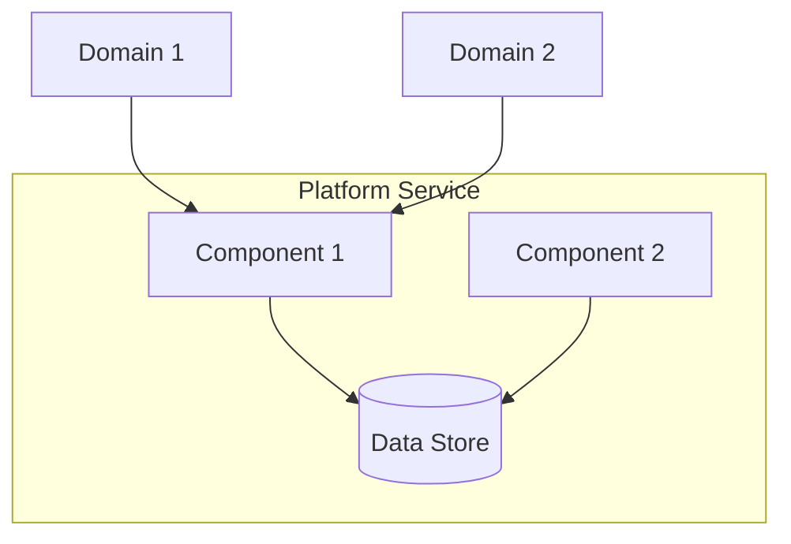

# {Platform Service} Architecture

> **Document Type**: Platform Architecture (Level 2)
> **Parent**: [System Architecture](../../ARCHITECTURE.md)
> **Last Updated**: {YYYY-MM-DD}
> **Owner**: Platform Team

## Purpose

This document describes the **{Platform Service}** shared infrastructure that all domains depend on. Changes to this platform affect the entire system and require careful coordination.

## Service Overview

### Business Value

{Why this platform service exists and what value it provides to the organization}

### Consumers

| Consumer | Usage Pattern | Criticality |
|----------|---------------|-------------|
| All domains | {How they use it} | {Critical/High/Medium} |
| {Specific domain} | {Special usage} | {Level} |

## Architecture

### High-Level Diagram



### Components

#### {Component 1}

| Attribute | Value |
|-----------|-------|
| **Responsibility** | {What it does} |
| **Technology** | {Stack} |
| **Scaling** | {Strategy} |
| **SLA** | {Availability, latency} |

#### {Component 2}

{Repeat structure}

## Interfaces

### API for Domain Consumption

**Base URL**: `{protocol}://{host}/{path}`

**Authentication**: {Method}

**Rate Limits**: {Per-consumer limits}

#### {Endpoint 1}

```
{METHOD} /{path}

Request:
{Example request}

Response:
{Example response}
```

### Configuration Interface

How domains configure their usage of this platform service.

{Configuration options and how to set them}

## Operational Model

### Deployment

| Environment | Configuration | Notes |
|-------------|---------------|-------|
| Development | {Config} | {Notes} |
| Staging | {Config} | {Notes} |
| Production | {Config} | {Notes} |

### Scaling

| Trigger | Action | Limits |
|---------|--------|--------|
| {Metric > threshold} | {Scale action} | {Min/Max} |

### Disaster Recovery

| Scenario | RTO | RPO | Procedure |
|----------|-----|-----|-----------|
| {Failure type} | {Time} | {Time} | [→ Runbook](./runbooks/{scenario}.md) |

## Capacity Planning

### Current Utilization

| Resource | Capacity | Current Usage | Headroom |
|----------|----------|---------------|----------|
| {Resource} | {Max} | {Current} |  | {Capacity} |
| 1 year | {%} | {Capacity} |

## Dependencies

### External Dependencies

| Dependency | Purpose | Fallback |
|------------|---------|----------|
| {Service} | {Why needed} | {What happens if unavailable} |

### Internal Dependencies

| Dependency | Purpose | Criticality |
|------------|---------|-------------|
| {Platform service} | {Why needed} | {Level} |

## Security

### Access Control

| Role | Permissions |
|------|-------------|
| Platform Admin | Full access |
| Domain Service | {Scoped access} |

### Data Handling

{How data flows through this service and what protections apply}

## Monitoring

### Health Checks

| Check | Endpoint | Interval | Timeout |
|-------|----------|----------|---------|
| Liveness | {path} | {interval} | {timeout} |
| Readiness | {path} | {interval} | {timeout} |

### Key Metrics

| Metric | Description | Alert Threshold |
|--------|-------------|-----------------|
| {metric_name} | {Description} | {Threshold} |

### Dashboards

- [Platform Overview]({link})
- [{Service} Details]({link})

## Change Management

### Impact Assessment

Changes to this platform service may affect all domains. Before making changes:

1. Assess which domains are affected
2. Communicate planned changes in advance
3. Provide migration path for breaking changes
4. Coordinate deployment timing

### Deprecation Policy

When deprecating features:
1. Announce deprecation with timeline (minimum 3 months)
2. Provide migration documentation
3. Monitor usage of deprecated features
4. Remove only after all consumers migrated

## Support

### Escalation Path

| Level | Contact | Response Time |
|-------|---------|---------------|
| L1 | {Team/Channel} | {Time} |
| L2 | {Team/Channel} | {Time} |
| L3 | {Team/Channel} | {Time} |

### Known Issues

| Issue | Workaround | Status |
|-------|------------|--------|
| {Issue} | {Workaround} | {Tracking link} |

## Related Decisions

| ADR | Date | Summary |
|-----|------|---------|
| [ADR-XXX](../../decisions/ADR-XXX.md) | {Date} | {Title} |
