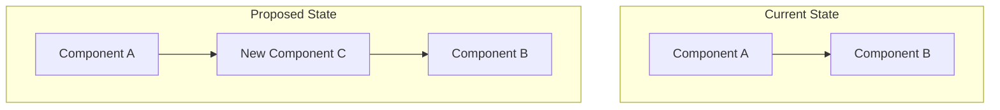
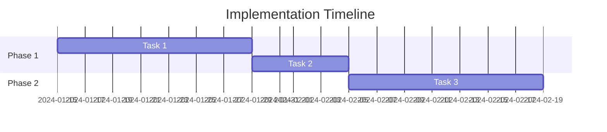

# RFC-{NUMBER}: {TITLE}

## Metadata

| Field | Value |
|-------|-------|
| **Author** | {Name <email>} |
| **Created** | {YYYY-MM-DD} |
| **Updated** | {YYYY-MM-DD} |
| **Status** | Draft |
| **Target Version** | {Version or release} |
| **Implementation Target** | {YYYY-MM-DD or Quarter} |
| **Estimated Effort** | {Person-weeks} |

### Required Reviewers

- [ ] {Reviewer 1 - Role}
- [ ] {Reviewer 2 - Role}
- [ ] {Reviewer 3 - Role}

### Stakeholders

- {Team/Person} - {Interest/Impact}

---

## Summary

{2-3 sentences that capture the essence of this proposal. A busy executive should understand the what and why from this paragraph alone.}

## Motivation

### Problem Statement

{Describe the problem clearly and specifically:
- What is the current situation?
- What is wrong or suboptimal about it?
- Who is affected and how?}

### Evidence

{Support the problem statement with data:
- Metrics showing impact
- User feedback or complaints
- Incident reports
- Technical debt measurements}

### Goals

This RFC aims to achieve:

1. {Primary goal - measurable}
2. {Secondary goal - measurable}
3. {Tertiary goal - measurable}

### Non-Goals

This RFC explicitly does NOT aim to:

1. {Something that might be assumed but is out of scope}
2. {Related problem we're not solving now}

## Detailed Design

### Overview

{High-level description of the proposed solution. Explain the approach conceptually before diving into details.}

### Architecture Diagram



{Explain what the diagram shows}

### Component Design

#### {Component 1 Name}

**Purpose**: {Single sentence describing responsibility}

**Interfaces**:

```
// Input
POST /api/v1/resource
{
  "field": "type"
}

// Output
{
  "id": "string",
  "status": "string"
}
```

**Dependencies**:
- {Component/Service} - {Purpose}

**Data Owned**:
- {Data entity} - {Description}

**Key Behaviors**:
1. {Behavior 1}
2. {Behavior 2}

#### {Component 2 Name}

{Repeat structure for each significant component}

### Data Model

#### New Entities

```sql
CREATE TABLE {table_name} (
    id UUID PRIMARY KEY,
    {column} {TYPE} {CONSTRAINTS},
    created_at TIMESTAMP NOT NULL DEFAULT NOW(),
    updated_at TIMESTAMP NOT NULL DEFAULT NOW()
);

-- Indexes
CREATE INDEX idx_{table}_{column} ON {table_name}({column});
```

#### Schema Changes

| Table | Change | Migration Strategy |
|-------|--------|-------------------|
| {table} | Add column {name} | Nullable first, backfill, then NOT NULL |

### API Design

#### New Endpoints

**POST /api/v1/{resource}**

Create a new {resource}.

Request:
```json
{
  "field1": "string",
  "field2": 123
}
```

Response (201 Created):
```json
{
  "data": {
    "id": "uuid",
    "field1": "string",
    "field2": 123,
    "created_at": "2024-01-15T10:30:00Z"
  }
}
```

Error Responses:
| Status | Code | Description |
|--------|------|-------------|
| 400 | VALIDATION_ERROR | Invalid input |
| 409 | CONFLICT | Resource already exists |

#### Modified Endpoints

{Document any changes to existing endpoints}

### Security Considerations

#### Authentication

{How will users/services authenticate?}

#### Authorization

{What permissions are required? How are they checked?}

#### Data Protection

{How is sensitive data protected at rest and in transit?}

#### Audit

{What actions will be logged for audit purposes?}

### Observability

#### Metrics

| Metric | Type | Description |
|--------|------|-------------|
| `{namespace}_{metric}_total` | Counter | {Description} |
| `{namespace}_{metric}_seconds` | Histogram | {Description} |

#### Logs

| Event | Level | Fields |
|-------|-------|--------|
| {event_name} | INFO | `{field1}`, `{field2}` |

#### Alerts

| Alert | Condition | Severity | Runbook |
|-------|-----------|----------|---------|
| {AlertName} | {condition} | {P1/P2/P3} | {link} |

### Error Handling

| Error Case | Handling Strategy | User Impact |
|------------|-------------------|-------------|
| {Error 1} | {How handled} | {What user sees} |

## Alternatives Considered

### Alternative 1: {Name}

{Description of the alternative approach}

**Advantages**:
- {Pro 1}
- {Pro 2}

**Disadvantages**:
- {Con 1}
- {Con 2}

**Why Not Chosen**: {Specific reasoning}

### Alternative 2: {Name}

{Repeat structure}

### Alternative 3: Do Nothing

{Describe what happens if we don't act}

**Why Not Acceptable**: {Specific reasoning}

## Migration Strategy

### Prerequisites

Before migration begins:
- [ ] {Prerequisite 1}
- [ ] {Prerequisite 2}

### Phase 1: {Name} ({Duration})

**Objective**: {What this phase achieves}

**Steps**:
1. {Step 1}
2. {Step 2}
3. {Step 3}

**Verification**:
- {How we know this phase succeeded}

**Rollback Plan**:
- {How to revert if issues arise}

### Phase 2: {Name} ({Duration})

{Repeat structure}

### Phase 3: Cleanup ({Duration})

**Objective**: Remove legacy code and data

**Steps**:
1. Remove feature flags
2. Delete deprecated endpoints
3. Drop old database columns
4. Archive old documentation

## Risks and Mitigations

| Risk | Probability | Impact | Mitigation |
|------|-------------|--------|------------|
| {Risk description} | High/Medium/Low | High/Medium/Low | {Mitigation strategy} |
| {Risk description} | High/Medium/Low | High/Medium/Low | {Mitigation strategy} |
| {Risk description} | High/Medium/Low | High/Medium/Low | {Mitigation strategy} |

### Contingency Plans

**If {scenario}**: {What we will do}

## Resource Requirements

### Team

| Role | Allocation | Duration |
|------|------------|----------|
| {Role} | {%} | {Weeks} |

### Infrastructure

| Resource | Specification | Cost |
|----------|--------------|------|
| {Resource} | {Spec} | {$/month} |

### Dependencies on Other Teams

| Team | Dependency | Status |
|------|------------|--------|
| {Team} | {What we need} | {Confirmed/Pending} |

## Success Metrics

| Metric | Current | Target | Measurement Method |
|--------|---------|--------|-------------------|
| {Metric 1} | {Value} | {Value} | {How measured} |
| {Metric 2} | {Value} | {Value} | {How measured} |

### Success Criteria

This RFC will be considered successful when:
1. {Criterion 1 - specific and measurable}
2. {Criterion 2 - specific and measurable}

## Timeline



| Milestone | Target Date | Status |
|-----------|-------------|--------|
| RFC Approved | {Date} | Pending |
| Phase 1 Start | {Date} | - |
| Phase 1 Complete | {Date} | - |
| Phase 2 Complete | {Date} | - |
| Full Rollout | {Date} | - |

## Open Questions

{List questions that need resolution before or during implementation}

1. **{Question}**
   - Context: {Why this matters}
   - Options: {Possible answers}
   - Owner: {Who will resolve}
   - Due: {When needed}

2. **{Question}**
   {Repeat structure}

## References

### Internal

- {Link to related ADRs}
- {Link to related RFCs}
- {Link to design documents}

### External

- {Link to relevant documentation}
- {Link to research or benchmarks}
- {Link to similar implementations}

## Appendix

### A: Detailed Calculations

{Supporting calculations or analysis}

### B: Full API Specification

{Complete OpenAPI spec if needed}

### C: Benchmark Results

{Performance testing data}

---

## Review Comments

### {YYYY-MM-DD} - {Reviewer Name}

**Status**: {Approved / Requesting Changes / Blocking}

{Detailed feedback}

**Action Items**:
- [ ] {Action 1}
- [ ] {Action 2}

---

### {YYYY-MM-DD} - {Reviewer Name}

{Repeat structure for each review}
